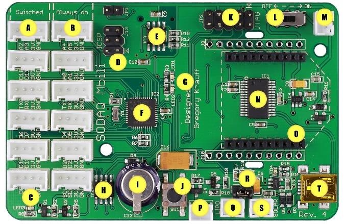
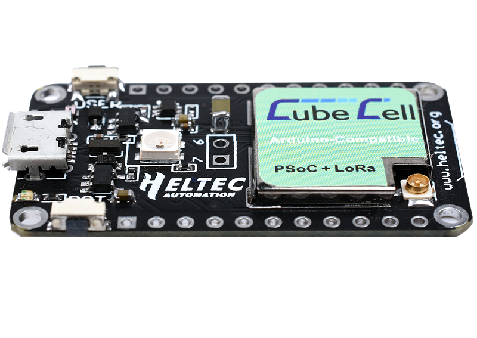

# DIY automatic monitoring station

This page provides different low-cost arduino based automatic datalogger solutions developed in the framework of my PhD work in a remote high alpine environment.
It contains all necessary information for the replication of such solutions and should be accessible for non-expert users. The solutions proposed here are based on my own experience and I stress that I had no prior training in sensor development nor electronics.

While the most simple <a href="https://www.arduino.cc/en/main/arduinoBoardUno">Arduino UNO</a> board only provides basic function to power low-power sensors, a large range of development boards were specifically developed to provide simple hardware solutions to develop low-cost dataloggers.
The main features of these boards are :
<ul>
  <li>The basic functions of an adruino boards (Microcontroller, digital, analog and I2C pins); </li>
  <li>A low-power consumption; </li>
  <li>A real-time clock (RTC) clock to record time and to allow an RTC external interrupts to wake up the board from deep sleep;</li>
  <li>A build-in connector for a 3.7V LiPo battery;</li>
  <li>A build-in connector for a 5V solar pannel with a charge controller;</li>
  <li>A build-in LoRa module or a socket to add a LoRa module with antenna;</li>
  <li>A SD Card holder to save data locally.</li>
</ul>  

## Arduino-based data acquisition board

We have tested and used three different development boards which are summarized hereafter.

### Seeeduino Stalker v3.1

<a href="https://wiki.seeedstudio.com/Seeeduino_Stalker_V3.1/">The Seeeduino Stalker v3.1</a> board contains all necessary features to build a simple local autonomious datalogger. It has a relatively low internal memory (Atmega328P) so that it should be used for small applications with only one or two sensors. It is the cheapest option but shows sometimes small bugs, although it is overall very satisfying. It is imported from the US and may be subject to supply limitation. You will need a <a href="https://wiki.seeedstudio.com/UartSBee_v5/">USB-UART converter</a> to communicate with the board.
  
A description of a simple water table monitoring project is available in the <a href="/standalone_logger">standalone_logger folder</a>.

 

### SODAQ Mbili

<a href="https://support.sodaq.com/Boards/Mbili/">The SODAQ Mbili</a> board is quite similar but has a larger memory (ATmega 1284P), has some more flexible hardware settings and comes with plug-in grove sockets. It is a bit more expensive and is imported from the Netherland (Europe). SODAQ also proposes a bee-socket where a <a href="https://shop.sodaq.com/lorabee-rn2483-order-now.html">LoRa bee-module</a> can be added in order to send data remotely. 
A quick note of caution : jumper SJ8 should be soldered to use external RTC interrupt.
  
A description of a simple water table monitoring project is available in the <a href="/standalone_logger">standalone_logger folder</a>.

 

### CubeCell Lora Dev-Board

<a href="https://heltec.org/product/htcc-ab01/">The CubeCell Lora</a> Dev-Board
  
A description of a simple water table monitoring project is available in the <a href="/LoRaWan_logger">LoRaWan_logger folder</a>.

 

