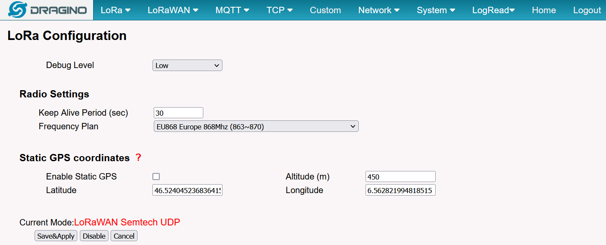
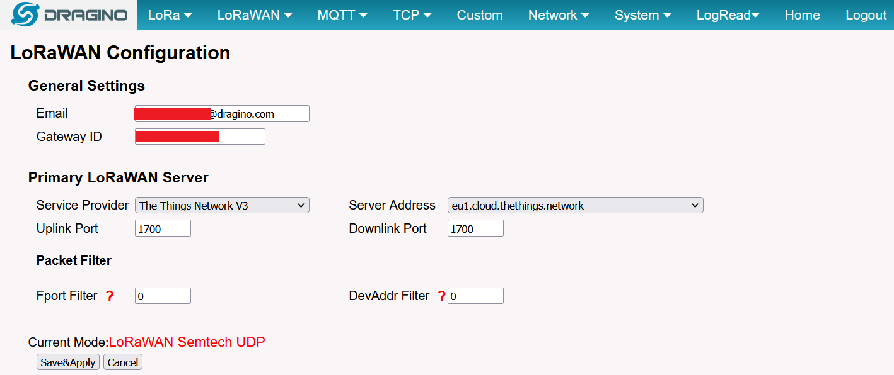
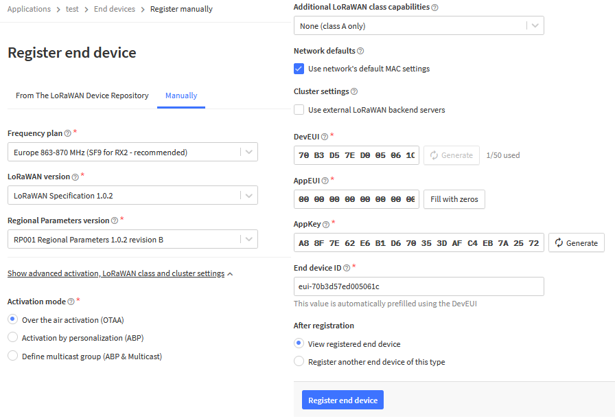

# LoRaWAN automatic datalogger 

This tutorial will describe the main procedure to develop an automatic connected datalogger to record and send data using the low-power LoRaWan network. The design was tested to record data from an ephemeral weather station on the surface of a glacier in the Swiss Alps. Data collected were air temperature, humidity and pressure as well as precipitation. In this first case, to 4G network was available so that a local LoRa network was developped to receive and store the data to a base station about 5 km below the glacier. A second set-up was installed near the city of Lausanne (Switzerland) were 4G network was available so that data were then transmited online to a remote server.

The architecture of the system is composed of different blocks :
 <ol>
  <li>The actual arduino-based datalogger with LoRa antenna. It reads data and send them via LoRa RF;</li>
  <li>A LoRaWAN gateway to receive any LoRa RF signal. It translate the data and send it via 4G or ethernet to a remote server (hosted on the web or your own connected Raspberry Pi). Alternatively, if no internet is available, a local WIFI network (without internet) can be set-up and the data can be pushed to a local server (Raspberry Pi) ;</li>
  <li>A server to communicate with the LoRaWAN gateway to store the data and provide queries for vizualisation (hosted on the web or your own connected Raspberry Pi).</li>
</ol> 

I also want to acknoledge the <a href="https://github.com/chrisys/mini-lora-weatherstation">following tutorial</a> which helped me get started ! 

## Arduino-based datalogger

We tested two different dataloggers. The first one is a <a href="https://heltec.org/product/htcc-ab01/">CubeCell Lora</a> Dev-Board. The second is a <a href="https://support.sodaq.com/Boards/Mbili/">SODAQ Mbili</a> equipped with a <a href="https://shop.sodaq.com/lorabee-rn2483-order-now.html">LoRa bee-module</a>.

### Hardware required
Links below are examples of hardware providers for Switzerland in 2022. Cost : ~50 to 75 CHF + sensors cost.
<ul>
  <li><a href="https://www.bastelgarage.ch/110x80x70mm-ip67-kunststoffgehause-transparent/">IP67 Outdoor Plastic Enclosure</a> 
  <li><a href="https://www.bastelgarage.ch/kabelverschraubung-m12-ip68/">Cable glands (M12 or M16)</a> 
  <li><a href="https://shop.sodaq.com/lithium-ion-polymer-battery-25-ah.html"> 3.7V 2500mAh LiPo battery (with 2 mm JST connector)</a>   
  <li><a href="https://shop.sodaq.com/05w-solar-panel.html">0.5W Solar Panel 55x70mm (with 2 mm JST connector)</a>  
  <li>The sensor you want to plug in. In our case, a typical (<a href="https://swisswetter.shop/Stand-alone-rain-collector-with-a-Vantage-Pro2-mounting-base">Tipping Bucket Rain Gauge</a>) and an air temperature/humidity/pressure protected by a simple radiation shield (<a href="sensor_temperature/">see post here</a>).
  </ul> 
For the SODAQ Mbili: 
<ul>
  <li><a href="https://shop.sodaq.com/sodaq-mbili.html">SODAQ Mbili</a>
  <li><a href="https://shop.sodaq.com/lorabee-rn2483-order-now.html">LoRa bee-module</a>
  <li>A cheap 4 GB SD card (or even smaller, you'll only need a few MB...)
  <li>Any USB-mini (B) cable for communication
</ul>
For the CubeCell Lora Dev-Board:
<ul>
  <li><a href="https://heltec.org/product/htcc-ab01/">CubeCell board</a> 
  <li>Any USB-Micro (B) cable for communication
</ul>
 

  <table>
      <tr>
          <td> </td>
          <td style="text-align:center"><em>Ephemeral weather station equipped with a CubeCell board enclosed in a simple watertight lunch box. Data are directly sent to a base station (LoRaWAN gateway), located ~5 km below the glacier. It is connected to a rain gauge and an air temperature/humiditiy/pressure protected by a simple radiation shield. The solar pannel can be left inside the box if the plastic is transparent. The station was installed on the Otemma glacier.</em></td>
      </tr>
  </table>

### Configuration

Firstly you will need to install the <a href="https://www.arduino.cc/en/software/">arduino IDE</a> and configure it to work with your board. For the Mbili you can check <a href="../logger_standalone_sodaq#configuration">this page</a>. For the CubeCell board, follow <a href="https://heltec-automation-docs.readthedocs.io/en/latest/cubecell/quick_start.html">this tutorial</a>.
 
 
Then download the <a href="scripts">arduino code</a>. You may need to download a few arduino libraries in the library manager (in Arduino IDE : Sketch -> Include Library -> Manage Library or Add .ZIP library), depending on the sensors you are connecting.

## LoRaWan gateway

The LoRaWAN gateway is the base station which will receive and decode any Lora RF signal (from all your devices) and transmit it to a remote server. As the LoRa network is becoming the main solution for the internet of Things (IoT), many gateways are beeing installed in urban areas. <a href="https://www.thethingsnetwork.org/">The Things Network (TTN)</a> is a global collaborative IoT ecosystem which allows to create an open network of LoRaWAN gateways on which you can freely rely. If your project is located inside the range of an existing gateway connected to TTN, you will be able to retrieve the data without the need to install your own gateway. In remote locations tough, you will need your own gateway.
If you don't need to set-up your own gateway, you can skip the next part and go to "Configuration of The Things Network"

### Installing your own LoRaWAN gateway
#### Hardware required
Links below are examples of hardware providers for Switzerland in 2022. Cost : ~600 CHF
<ul>
  <li><a href="https://www.bastelgarage.ch/dlos8-4g-version-outdoor-multichannel-lorawan-gateway?search=dl">Dragino gateway</a> 
  <li><a href="https://www.swiss-green.ch/fr/batteries-solaires-agm-batterie-solaire-agm/39110300-batterie-solaire-agm-22-ah.html">12V Battery ~20 Ah</a> 
  <li><a href="https://www.swiss-green.ch/fr/panneaux-solaires-polycristallins-panneau-solaire/39292055-panneau-solaire-polycristallin-45-w.html">Solar panel ~45W</a>
  <li><a href="https://www.swiss-green.ch/fr/regulateurs-charge-solaire-pwm-regulateurs-charge-solaires-pwm/39145100-regulateur-solaire-pwm-led-05-a-usb.html">Solar charge controler</a>
  <li><a href="https://www.swiss-green.ch/fr/3104-cables-solaire-pour-panneaux-photovoltaiques">Connection cables</a>
  <li><a href="https://www.bastelgarage.ch/kabelverschraubung-m12-ip68/">Cable glands (M16)</a> 
  <li><a href="https://de.vidaxl.ch/e/vidaxl-gefahrgutkoffer-schwarz-406x33x174-cm/8718475978503.html">A waterproof box (we use a pelican case in the field)</a>
</ul>

#### Configuration of the gateway
We used an outdoor 4G <a href="https://www.dragino.com/products/lora-lorawan-gateway/item/160-dlos8.html">Dragino gateway</a>. The configuration is detailed in <a href="https://www.dragino.com/downloads/index.php?dir=LoRa_Gateway/DLOS8/">the manual</a>, but here are the main steps. Once the antenna is powered, it should create a WIFI access point to which you can connect in your wifi settings and access the settings using the IP : "10.130.1.1". User Name: root, Password: dragino. You should then configure the LoRa configuration and LoRaWAN configuration (see image below). That's all ! Check in the home page that everything seems to work.

 
This is the configuration if your antenna is connected to internet. In case, you work in a remote area without 4G access, you can create a local LoRa network which does not connect to The Things Network, but rather directly send the data to a local server (raspberry pi) using MQTT. In this case, you need to configure the gateway to work with the built-in ABP decoder to MQTT mode (in LoRaWAN configuration). Please write to me in case you need help (I will try to do a tutorial later).

### Configuration of The Things Network
In this part, we will see how to add your end-device (the Cubecell or Sodaq logger) to The Thing Network (TTN) to retrieve your data. LoRaWAN uses two different activation mode (the way the device connects to the gateway), called ABP or OTAA. In both cases, the LoRa signal sent by the end-device is encrypted and you will need to enter some device security keys in TTN and in your end-device configuration in order to recognize and read the data, this is called "activation". ABP is simpler but a bit less secure, the end-device will only send data ("blindly") to the gateway but does not receive information in return. OTAA is more secure and after each activation or data sent from the device, the gateway will send back some confirmation message to the device, this is obviously the best procedure, but my experience showed that it is sometimes difficult to receive the return confirmation if you're a bit far from the gateway. More detailed info <a href="https://www.thethingsindustries.com/docs/devices/abp-vs-otaa/">here</a>. Let's use OTAA activation in the next part.

<ol>
  <li>First go to the europe server of TTN and create an account : https://eu1.cloud.thethings.network/console/.</li>
  <li>Go to application -> +add application. In this application, you will be able to add mutliple end-devices.</li>
  <li>Go to "Add end-device", and find your device (in our case, we will just do the configuration manually, as in the picture below. You can generate the keys automatically, and then add them to your Arduino code (<a href="scripts/cubecell_LORA_OTAA_rain_AHT20/ttnparams.h">here for example</a>). Once done, your device should be able to connect to TTN if a gateway is in the range. You should see some activity in the main "Overview" tab of your end-device.
   
 
 
  

    
  

  <li>Finally, we will need to decode the data sent in bytes to actual numbers. This is done in Application -> payload formatter -> Uplink. Here you will need to check how you coded those information in your arduino code. Using <a href="scripts/cubecell_LORA_OTAA_rain_AHT20/cubecell_LORA_OTAA_rain_AHT20.ino">this example</a>, we will decode the temperature, humditiy, pressure sensors as well as rain and battery state. We will use a "Custom javascript formatter" such as <a href="scripts/payload_javascript.txt">this one</a>. Now in the end-dice Live Data tab you should see your decoded payload !</li>  
  <li>Finally, now that we can read the data, we need to store them on a remote server. There are mutliple ways to achieve this. If you want to store your data online, one easy way is to use "The Thing Speak", following <a href="https://www.thethingsindustries.com/docs/integrations/cloud-integrations/thingspeak/">this tutorial</a>. Another possibility is to have your own web server. This last part is for more advanced users and is described in the next part. The main idea is to communicate between TTN and your server (in our case a Raspberry pi) using MQTT. In TTN, go to "Application -> Integrations -> MQTT" and write down the "Connection information".</li>
</ol>

## Server
In this last part, I propose to developp a server to store the data and provide an interface for vizualisation or queries using a Raspberry Pi.
This server can be used locally without internet access. In this case, the server is connected to the local Access Point of the LoRa Gateway and data are sent using the built-in MQTT mode from the gateway. Alternatively, the server can be connected to internet and will then receive the data from TTN using the MQTT protocol. The  main configuration is similar in both cases.

### Hardware required
 <ul>
  <li>Raspberry pi 3 model B (other model should work too)</li>
  <li>16 GB SDHC card</li>
</ul> 

<a href="">Read here</a>
### Configuration of the Rapsberry pi
I will not detail the whole process here, but will highlight the steps or tutorial which helped me get there. You will need to following functions :
<ol>
  <li>Install Rapbian OS. I usually do this without screen directly is SSH mode (see <a href="https://www.instructables.com/How-to-Setup-Raspberry-Pi-Without-Monitor-and-Keyb/">this tutorial</a>)</li>
  <li>You may then want to configure the WIFI connection (to access internet or the local access point). <a href="https://binaryupdates.com/how-to-configure-wifi-on-raspberry-pi-4/">Read here</a></li>
  <li>Update the Raspberry Pi. <a href="https://pimylifeup.com/raspberry-pi-update/">Read here</a></li>
</ol>
Then comes the main part, we will need a series of software which work together: <b>Mosquitto</b>, an MQTT broker which receives the data from TTN, <b>influxDB</b> to store the data, <b>telegraf</b> to transfer the data from Mosquitoo to the database and <b>Grafana</b> an application to vizualise the data and create queries. A few tutorials summarize the Influx, Telegraf, Grafana installation such as <a href="https://nwmichl.net/2020/07/14/telegraf-influxdb-grafana-on-raspberrypi-from-scratch/">this one</a>. The main steps are :   
 <ol>
  <li>First, let install the MQTT broker <b>Mosquitto</b>, <a href="https://www.instructables.com/Installing-MQTT-BrokerMosquitto-on-Raspberry-Pi/">read here</a>.</li>
  <li>Next, we will install <b>InfluxDB</b> (<a href="https://pimylifeup.com/raspberry-pi-influxdb/">read here</a>). This is an open-source database which is specifically designed to work fast for time series. Once installed, go on and create a database. Then add a user to allow editing of the database. In SSH command line type : <i>influx -execute "CREATE USER "telegraf" WITH PASSWORD '<your_password>' WITH ALL PRIVILEGES;"</i></li>
  <li>Then install <b>Telegraf</b>, <a href="https://computingforgeeks.com/install-and-configure-telegraf-on-debian-linux/">read here</a>. Then, let's configure telegraf. Type in command line : <i>sudo nano /etc/telegraf/telegraf.conf</i>, and edit the following section :
   
 

  <table style="width:100%;text-align:left;background-color:gold;>
      <tr>
          <td>
          [[inputs.mqtt_consumer]]
          servers = ["tcp://localhost:1883"]
          qos = 0
          connection_timeout = "30s"
          topics = [ "+/+/data" ]
          client_id = ""
          username = ""
          password = ""
          data_format = "json"
         </td>
      </tr>
      <tr>
          <td>
         [[outputs.influxdb]]
         urls = ["http://localhost:8086"]
         database = "meteodb1"
         retention_policy = ""
         write_consistency = "any"
         timeout = "5s"
         username = "telegraf"
         password = "qswd1234"
      </td>
      </tr>
  </table>

 
 
 
 </li>
  <li>First, let install the MQTT broker <b>Mosquitto</b>, <a href="https://www.instructables.com/Installing-MQTT-BrokerMosquitto-on-Raspberry-Pi/">read here</a>.</li>
 </ol>

   
   
 https://nwmichl.net/2020/07/14/telegraf-influxdb-grafana-on-raspberrypi-from-scratch/
   
 </li>
  <li></li>
</ol> 

https://nwmichl.net/2020/07/14/telegraf-influxdb-grafana-on-raspberrypi-from-scratch/
You will need to following functions :
 <ol>
  <li>Mosquitto (MQTT)</li>
  <li>influxDB</li>
  <li>Telegraf</li>
  <li>Grafana</li>
</ol> 

