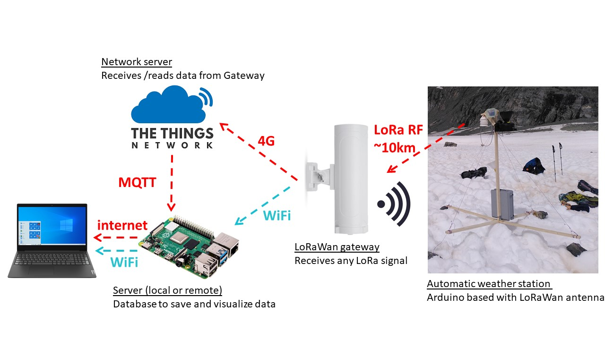
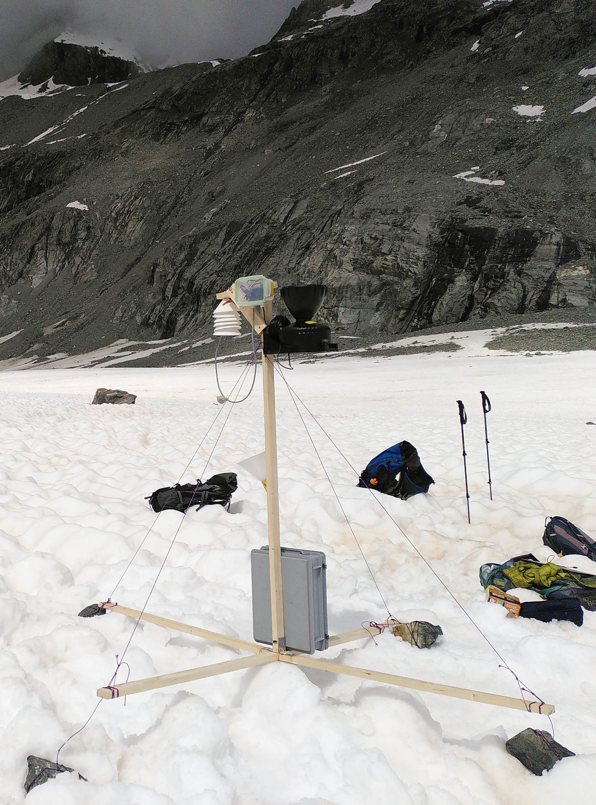

# LoRaWAN automatic datalogger 

This tutorial will describe the main procedure to develop an automatic connected datalogger to record and send data using the low-power LoRaWan network. The design was tested to record data from an ephemeral weather station on the surface of a glacier in the Swiss Alps. Data collected were air temperature, humidity and pressure as well as precipitation. In this first case, to 4G network was available so that a local LoRa network was developped to receive and store the data to a base station about 5 km below the glacier. A second set-up was installed near the city of Lausanne (Switzerland) were 4G network was available so that data were then transmited online to a remote server.

The architecture of the system is composed of different blocks :
 <ol>
  <li>The actual arduino-based datalogger with LoRa antenna. It reads data and send them via LoRa RF;</li>
  <li>A LoRaWAN gateway to receive any LoRa RF signal. It translate the data and send it via 4G or ethernet to a remote server (hosted on the web or your own connected Raspberry Pi). Alternatively, if no internet is available, a local WIFI network (without internet) can be set-up and the data can be pushed to a local server (Raspberry Pi) ;</li>
  <li>A server to communicate with the LoRaWAN gateway to store the data and provide queries for vizualisation (hosted on the web or your own connected Raspberry Pi).</li>
</ol> 

## Arduino-based datalogger

We tested two different dataloggers. The first one is a <a href="https://heltec.org/product/htcc-ab01/">CubeCell Lora</a> Dev-Board. The second is a <a href="https://support.sodaq.com/Boards/Mbili/">SODAQ Mbili</a> equipped with a <a href="https://shop.sodaq.com/lorabee-rn2483-order-now.html">LoRa bee-module</a>.

### Hardware required
Links below are examples of hardware providers for Switzerland in 2022.
<ul>
  <li><a href="https://www.bastelgarage.ch/110x80x70mm-ip67-kunststoffgehause-transparent/">IP67 Outdoor Plastic Enclosure</a> 
  <li><a href="https://www.bastelgarage.ch/kabelverschraubung-m12-ip68/">Cable glands (M12 or M16)</a> 
  <li><a href="https://shop.sodaq.com/lithium-ion-polymer-battery-25-ah.html"> 3.7V 2500mAh LiPo battery (with 2 mm JST connector)</a>   
  <li><a href="https://shop.sodaq.com/05w-solar-panel.html">0.5W Solar Panel 55x70mm (with 2 mm JST connector)</a>  
  <li>The sensor you want to plug in. In our case, a typical (<a href="https://swisswetter.shop/Stand-alone-rain-collector-with-a-Vantage-Pro2-mounting-base">Tipping Bucket Rain Gauge</a>) and an air temperature/humidity/pressure protected by a simple radiation shield (<a href="sensor_temperature/">see post here</a>).
  </ul> 
For the SODAQ Mbili: 
<ul>
  <li><a href="https://shop.sodaq.com/sodaq-mbili.html">SODAQ Mbili</a>
  <li>A cheap 4 GB SD card (or even smaller, you'll only need a few MB...)
  <li>Any USB-mini (B) cable for communication
</ul>
For the CubeCell Lora Dev-Board:
<ul>
  <li><a href="https://heltec.org/product/htcc-ab01/">CubeCell board</a> 
  <li>Any USB-Micro (B) cable for communication
</ul>
 

  <table>
      <tr>
          <td> </td>
          <td style="text-align:center"><em>The first version of the datalogger equipped with the Mbili board enclosed in a simple watertight lunch box for testing. It is connected to a water pressure sensor inserted in a screened piezometer and an air temperature/humiditiy/pressure protected by a simple radiation shield. The solar pannel can be left inside the box if the plastic is transparent. The station was installed in the glacier forefield of the Otemma catchment</em></td>
      </tr>
  </table>

## Configuration

Firstly you will need to install the <a href="https://www.arduino.cc/en/software/">arduino IDE</a> and configure it to work with your board. For the Mbili you can check <a href="../logger_standalone_sodaq#configuration">this page</a>. For the CubeCell board, follow <a href="https://heltec-automation-docs.readthedocs.io/en/latest/cubecell/quick_start.html/">this tutorial</a>
 
 
Then download the <a href="scripts">arduino code</a>. You may need to download a few arduino libraries in the library manager (in Arduino IDE : Sketch -> Include Library -> Manage Library or Add .ZIP library), depending on the sensors you are connecting.

## LoRaWan gateway

## Server

