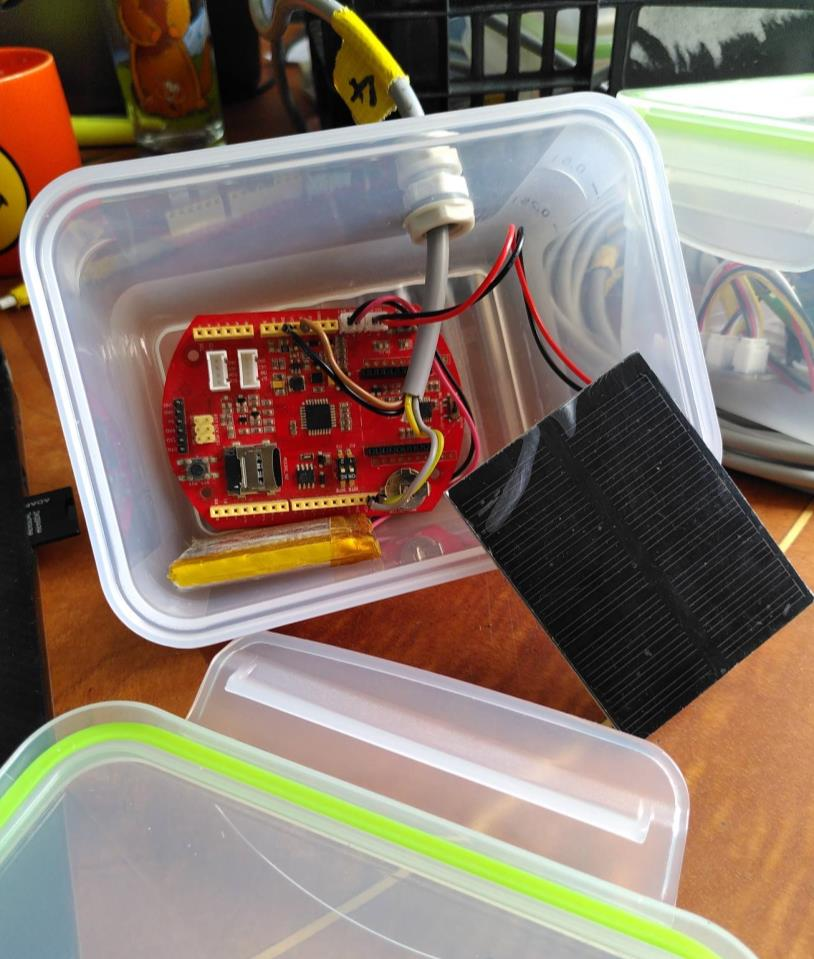

# Stand-alone Logger (Seeeduino stalker v3.1)
An automatic stand-alone datalogger to record and save data locally on an SD card.

<a href="">ss</a>
## Hardware required
Links below are examples of hardware providers for Switzerland in 2022.
<ul>
  <li><a href="https://www.bastelgarage.ch/110x80x70mm-ip67-kunststoffgehause-transparent/">IP67 Outdoor Plastic Enclosure</a> 
  <li><a href="https://www.bastelgarage.ch/kabelverschraubung-m12-ip68/">Cable glands (M12 or M16)</a> 
  <li><a href="https://eckstein-shop.de/LiPoAkkuLithium-IonPolymerBatterie32C7V2000mAhJST-PHConnectorEN"> 3.7V 2000mAh LiPo battery (with 2 mm JST connector)</a>   
  <li><a href="https://eckstein-shop.de/SeeedStudio05WSolarPanel55x70CMEN">0.5W Solar Panel 55x70mm (with 2 mm JST connector)</a>  
  <li>A cheap 4 GB SD card (or even smaller, you'll only need a few MB...)
  <li><a href="https://www.seeedstudio.com/Seeeduino-Stalker-V3-1-p-2686.html">The arduino-based board : Seeeduino Stalker V3.1</a> (currently out of order in May 2022)
  <li><a href="https://wiki.seeedstudio.com/UartSBee_v5/">USB-UART converter</a> to communicate with the board
  <li>The sensor you want to plug in. In our case a water pressure sensor, <a href="sensor_waterpressure/">see other post here</a>
</ul>
 

  <table>
      <tr>
          <td> </td>
          <td style="text-align:center"><em>The equiped seeeduino board enclosed in a simple watertight lunch box for testing. The solar pannel can be left inside the box if the plastic is transparent. </em></td>
      </tr>
  </table>

## Configuration

Firstly you will need to install the arduino IDE and configure it to work with Seeeduino stalker. All steps are described in <a href="https://wiki.seeedstudio.com/Seeeduino_Stalker_V3.1/">this tutorial</a>. Don't miss <a href="https://wiki.seeedstudio.com/Seeed_Arduino_Boards/">the actual configuration (step 4)</a>. Once everything is set-up, try to run the blink example to make sure everything works !

Then download the <a href="scripts">arduino code</a>

