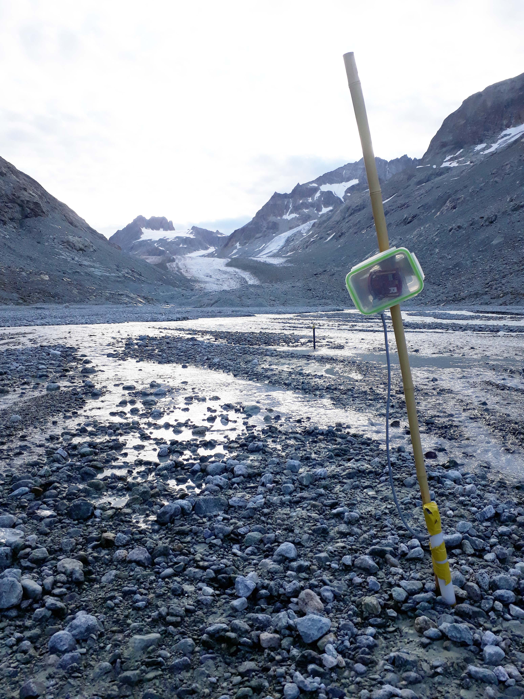

# Stand-alone Logger (Seeeduino stalker v3.1)
This page describes the set-up of an automatic stand-alone datalogger to record and save data from a waterproof pressure sensors locally on an SD card. You can also check the similar set-up, but using <a href="https://www.bastelgarage.ch/110x80x70mm-ip67-kunststoffgehause-transparent/">SODAQ mbili board</a>.

## Hardware required
Links below are examples of hardware providers for Switzerland in 2022.
<ul>
  <li><a href="https://www.bastelgarage.ch/110x80x70mm-ip67-kunststoffgehause-transparent/">IP67 Outdoor Plastic Enclosure</a> 
  <li><a href="https://www.bastelgarage.ch/kabelverschraubung-m12-ip68/">Cable glands (M12 or M16)</a> 
  <li><a href="https://eckstein-shop.de/LiPoAkkuLithium-IonPolymerBatterie32C7V2000mAhJST-PHConnectorEN"> 3.7V 2000mAh LiPo battery (with 2 mm JST connector)</a>  
  <li><a href="https://eckstein-shop.de/SeeedStudio05WSolarPanel55x70CMEN">0.5W Solar Panel 55x70mm (with 2 mm JST connector)</a>  
  <li>A cheap 4 GB SD card (or even smaller, you'll only need a few MB...)
  <li><a href="https://www.seeedstudio.com/Seeeduino-Stalker-V3-1-p-2686.html">The arduino-based board : Seeeduino Stalker V3.1</a> (currently out of order in May 2022)
  <li><a href="https://wiki.seeedstudio.com/UartSBee_v5/">USB-UART converter</a> to communicate with the board, and some female-female jumpers.
  <li>The sensor you want to plug in. In our case a water pressure sensor, <a href="../sensor_waterpressure/">see other post here</a>
</ul>
 

  <table>
      <tr>
          <td> </td>
          <td style="text-align:center"><em>The equipped seeeduino board enclosed in a simple watertight lunch box for testing. The solar pannel can be left inside the box if the plastic is transparent. </em></td>
      </tr>
  </table>

## Configuration

Firstly you will need to install the <a href="https://www.arduino.cc/en/software/">arduino IDE</a> and configure it to work with Seeeduino stalker. All steps are described in <a href="https://wiki.seeedstudio.com/Seeeduino_Stalker_V3.1/">this tutorial</a>. Don't miss <a href="https://wiki.seeedstudio.com/Seeed_Arduino_Boards/">the actual configuration (step 4)</a>. The main steps are : 
<ul>
  <li> Open your Arudino IDE, click on File -> Preferences, and copy below url to Additional Boards Manager URLs : https://raw.githubusercontent.com/Seeed-Studio/Seeed_Platform/master/package_legacy_seeeduino_boards_index.json
  <li> Then in "Tools -> Board -> Board Manager", look for "Seeeduino Stalker" and install Seeeduino Stalker V3
  <li> Go back in "Tools -> Board" make sure to select "Seeeduino Stalker V3
  <li> Finally, plug the USB Serial adapter to the Seeeduino board and in "Tools -> Port" check that you are using the right COM port.
</ul>
Once everything is set-up, try to run the blink example to make sure everything works !
 
 
Then download the <a href="scripts">arduino code</a>. You may need to download a few arduino libraries in the library manager (in Arduino IDE : Sketch -> Include Library -> Manage Library or Add .ZIP library), depending on the sensors you are connecting. In our example, we only need to search and download the "SparkFun_MS5803_I2C.h" library.

 
 

  <table>
      <tr>
          <td> </td>
      </tr>
      <tr>
          <td style="text-align:center"><em>First version of the datalogger working in the glacier forefield of the Otemma catchment.</em></td>
      </tr>
  </table>

