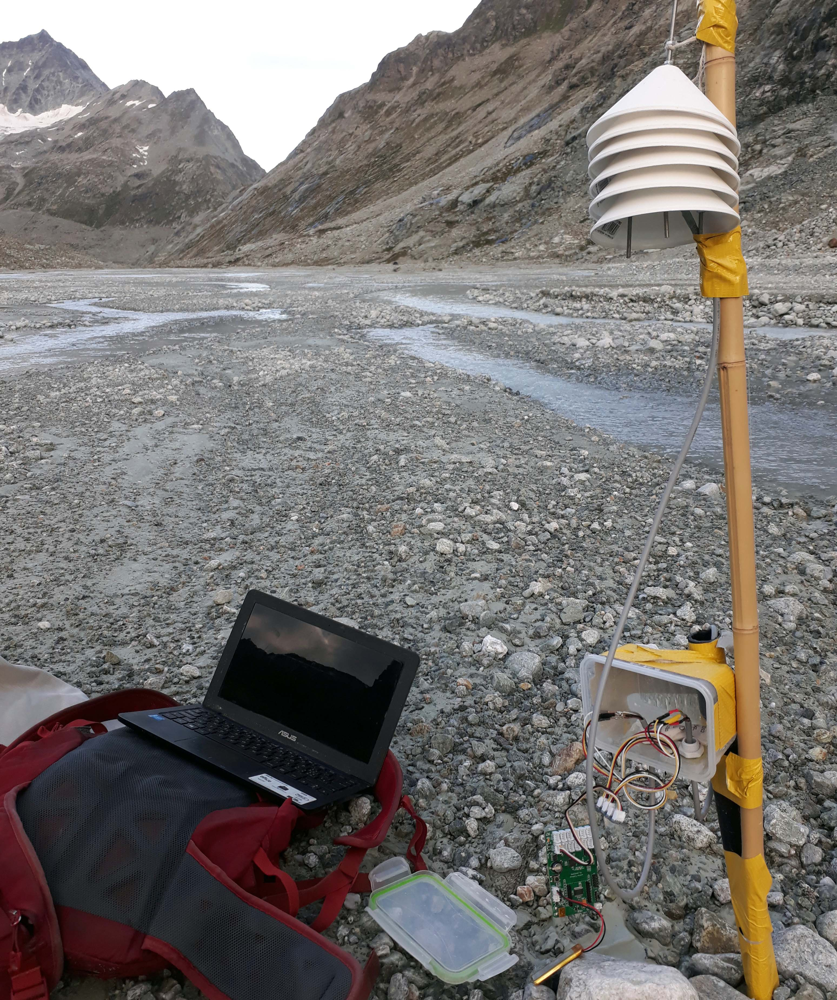

# Stand-alone Logger (SODAQ Mbili)
This page describes the set-up of an automatic stand-alone datalogger to record and save data locally on an SD card using the SODAQ Mbili board. This page is similar to the <a href="../logger_standalone_seed">Seeeduino tutorial</a>, but using a different board.

## Hardware required
Links below are examples of hardware providers for Switzerland in 2022.
<ul>
  <li><a href="https://www.bastelgarage.ch/110x80x70mm-ip67-kunststoffgehause-transparent/">IP67 Outdoor Plastic Enclosure</a> 
  <li><a href="https://www.bastelgarage.ch/kabelverschraubung-m12-ip68/">Cable glands (M12 or M16)</a> 
  <li><a href="https://shop.sodaq.com/lithium-ion-polymer-battery-25-ah.html"> 3.7V 2500mAh LiPo battery (with 2 mm JST connector)</a>   
  <li><a href="https://shop.sodaq.com/05w-solar-panel.html">0.5W Solar Panel 55x70mm (with 2 mm JST connector)</a>  
  <li>A cheap 4 GB SD card (or even smaller, you'll only need a few MB...)
  <li><a href="https://shop.sodaq.com/sodaq-mbili.html">The arduino-based board : SODAQ Mbili</a>
  <li>The sensor you want to plug in. In our case, a water pressure sensor, <a href="sensor_waterpressure/">see other post here</a>
</ul>

 

  <table>
      <tr>
          <td> </td>
          <td style="text-align:center"><em>The first version of the datalogger equipped with the Mbili board enclosed in a simple watertight lunch box for testing. The solar pannel can be left inside the box if the plastic is transparent. The station was installed in the glacier forefield of the Otemma catchment</em></td>
      </tr>
  </table>

## Configuration

Firstly you will need to install the <a href="https://www.arduino.cc/en/software/">arduino IDE</a> and configure it to work with SODAQ Mbili. The Mbili tutorial is <a href="https://support.sodaq.com/Boards/Mbili/">found here</a>, but to get started follow the <a href="https://learn.sodaq.com/getting_started/#beta">actual configuration page</a>. The main steps are :  
    
<ul>
  <li> Open your Arudino IDE, click on File -> Preferences, and copy below url to Additional Boards Manager URLs : http://downloads.sodaq.net/package_sodaq_avr_index.json
  <li> Then in 'Tools -> Board -> Board Manager', look for 'SODAQ' and install SODAQ AVR Boards
  <li> Go back in 'Tools -> Board' make sure to select 'SODAQ Mbili'
  <li> Finally, plug the USB adapter to the Mbili board and in 'Tools -> Port' check that you are using the right COM port.
  <li> One last note : to use external RTC interrupt (to wake up from deep sleep) jumper SJ8 should be soldered !
</ul>
Once everything is set-up, try to run the blink example to make sure everything works !
 
 
Then download the <a href="scripts">arduino code</a>. You may need to download a few arduino libraries in the library manager (in Arduino IDE : Sketch -> Include Library -> Manage Library or Add .ZIP library), depending on the sensors you are connecting. In our example, we only need to search and download the "SparkFun_MS5803_I2C.h" library.

