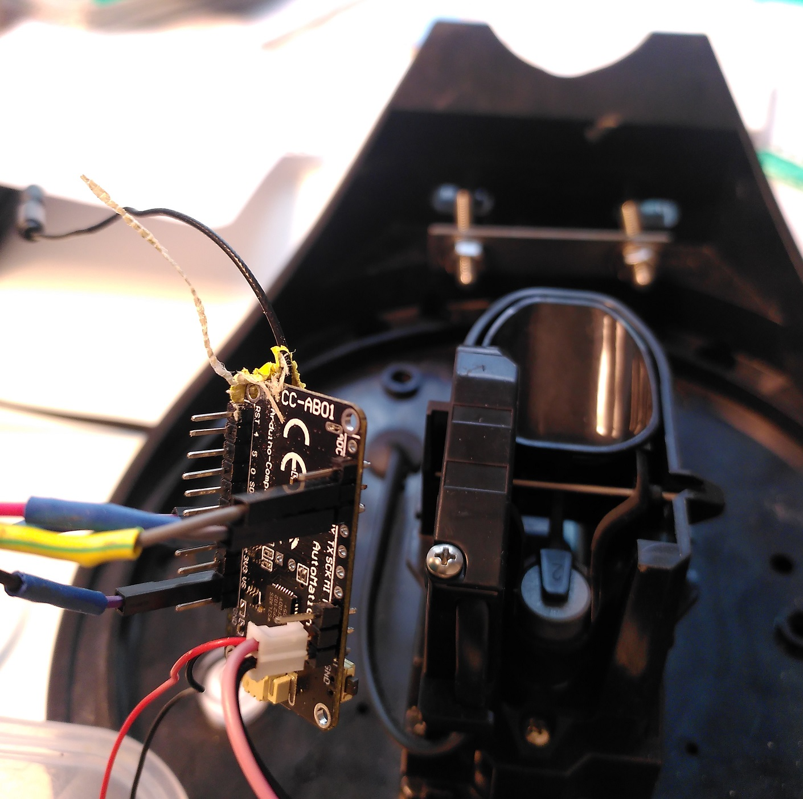

# Rain gauge

Here we will see how to connect a simple tipping bucket rain gauge to an arduino. The tipping bucket uses a simple mechanism using a "reed switch". When the bucket tips, the magnet will apply a magnetic field which will shortly close the electrical switch. So we only need to create a simple electrical circuit with a resistance and count the number of times when we observe a short spike of the tension (the number of tips). This is easily done using any digital pin. In case we use a deep sleep mode, we can configure the board to wake up using an external interrupt which is triggered when there is a change of tension on the selected pin.

## Hardware
<ul>
  <li>A typical <a href="https://swisswetter.shop/Stand-alone-rain-collector-with-a-Vantage-Pro2-mounting-base">Tipping Bucket Rain Gauge</a>
</ul> 

## Wiring
Usually the tipping bucket will have 2 to 3 wires. Attach one wire to power, one wire to ground and the last to any digital pin. If needed, make some tests to identify which wire corresponds to 5V, GND and SIGNAL. Usually, there is a resistor in the tipping bucket device already so you can directly connect the cables to the arduino.

## Code
You can download an example of a LoRaWAN rain gauge automatic station using either the <a href="../logger_LoRaWan/scripts/mbili_datalogger_LORA/mbili_datalogger_LORA.ino">Mbili</a> or <a href="../logger_LoRaWan/scripts/cubecell_LORA_OTAA_rain_AHT20/cubecell_LORA_OTAA_rain_AHT20.ino">CubeCell</a> boards. For LoRa, I suggest to also send the cumulative rain amounts so that you would get the right amounts even if the transmission of some data was lost.

