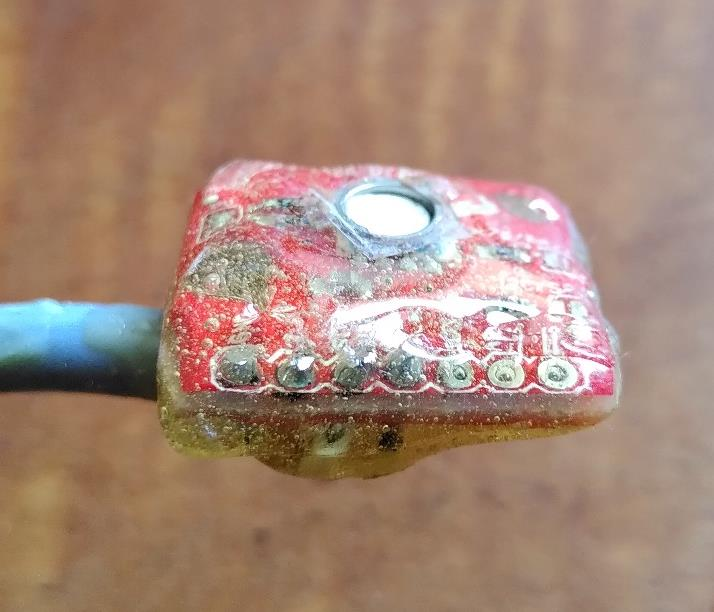
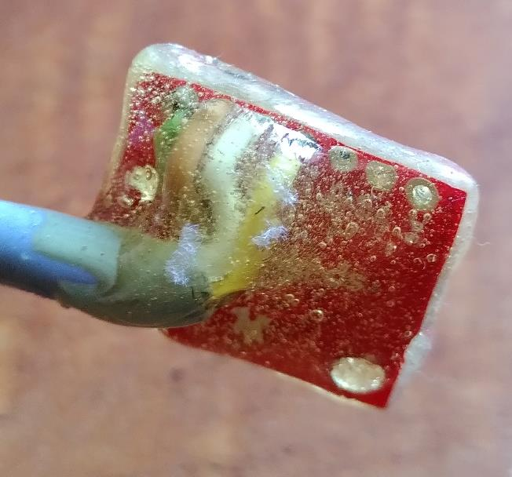

# Waterproof pressure sensor

This sensor was inspired from this <a href="https://www.envirodiy.org/construction-of-water-level-monitoring-sensor-station/">post of enviroDIY</a>. 
Links below are examples of hardware providers for Switzerland in 2022.

The idea is to use a high resolution pressure valve (MS5803-14BA), solder a cable to the pins and envelop it with epoxy glue. All info can be found on the link above.
My current design is composed of the following components :
<ul> 
  <li><a href="https://www.digikey.ch/short/25zndvnp">1x MS5803-14BA</a>
  <li><a href="https://www.distrelec.ch/en/multicore-cable-yy-pvc-4x-5mm-grey-50m-lapp-00100024-50/p/30049250?no-cache=true&track=true">2.5 meters Mutlicore cable (4x0.5mm2)</a>
  <li><a href="https://www.reichelt.com/de/en/wiko-epoxy-adhesive-5-min-wiko-epo5-s25-p98449.html?r=1">Epoxy glue</a>
  <li><a href="https://www.reichelt.com/de/en/acrylic-protective-lacquer-400-ml-rnd-605-00135-p211619.html?r=1">Acrylic lacquer</a>
</ul>

You basically solder the cable, spray lacquer (but care to protect the white pressure valve), apply epoxy arond the circuit board. This design is very rough and can clearly be improved, but it showed satisfying results to monitor water pressure during one year in a 2 m deep well.

In order to measure actual water level elevation, it is required to substract absolute air pressure to the measured total pressure in order to calculate the water pressure only. This can be achieved by using an additional sensor such as a <a href="https://wiki.seeedstudio.com/Grove-Barometer_Sensor-BME280/">BME sensor</a>. See the <a href="/sensor_temperature">following page</a> for more information.

  
   

